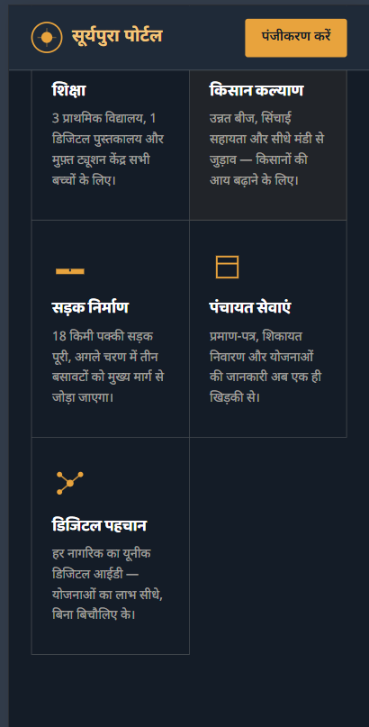
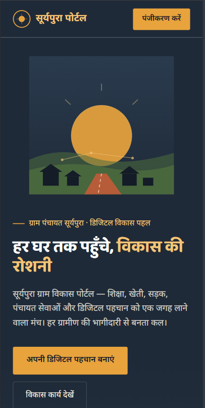

# सूर्यपुरा ग्राम विकास पोर्टल

A fictional rural development portal demo focused on education, farmer welfare, roads, पंचायत services, and digital identity.

## Overview

The homepage presents सूर्यपुरा as a digitally connected village. It includes a visionary rural development ambassador, community-focused content, project progress reporting, and a clear registration call to action.

## Features

- Responsive hero banner with village development messaging
- Rural development ambassador profile and leadership message
- Five development pillars:
	- Education
	- Farmer welfare
	- Road construction
	- पंचायत services
	- Digital identity
- 2026 project progress report with visual progress bars
- Social-media-style community posts
- Mobile-friendly responsive layout
- Smooth navigation between homepage sections

## Design Direction

The design uses a dark indigo base for trust and stability, gold for sunlight and hope, green for agriculture, and clay tones for soil and infrastructure. Hindi-first content creates a strong local connection, while the structured layout keeps the portal clear and easy to scan.

## Tech Stack

- HTML5
- CSS3
- Inline SVG illustrations
- Google Fonts: Baloo 2 and Noto Sans Devanagari

## Run Locally

No build tools or dependencies are required.

1. Clone or download the repository.
2. Open `index.html` in a web browser.

Alternatively, serve the folder with any local web server:

```bash
python -m http.server
```

Then open `http://localhost:8000`.

## Mobile Views

The homepage is optimized for mobile screens, with a single-column layout for the hero content, development pillars, progress report, and community posts.





## Project Structure

```text
Assignment/
├── index.html       # Complete homepage demo
├── MobileView1.png  # Mobile homepage screenshot 1
├── MobileView2.png  # Mobile homepage screenshot 2
└── README.md        # Project documentation
```

## Note

This is a fictional demonstration project. सूर्यपुरा is not a real government portal or village service.